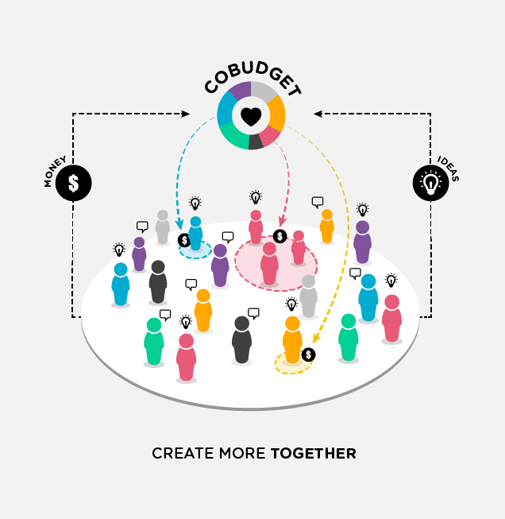

# Welcome!

## How to run a kick-ass collaborative funding round in 5-steps.

### This is a guide about the practice of 'collaborative funding' and a five step recipe to getting started with it. 

## To navigate this guide


* Read the[ Introduction](basics/introduction.md)
* Check out the **table of contents on the left**
* Browse the five steps:
  * [Step 1: Choose your money governance model](the-5-steps/untitled.md)
  * [Step 2: Invitation & onboarding](the-5-steps/step-2-invitation-and-onboarding.md)
  * [Step 3: Generating direction with high quality proposals](the-5-steps/step-3-generating-direction-with-high-quality-proposals/)
  * [Step 4: Get those proposals funded](the-5-steps/step-4-get-those-proposals-funded.md)
  * [Step 5: Minimum Viable Accountability](the-5-steps/step-5-minimum-viable-accountability.md)
* Look out for the **case studies** in orange boxes, with tangible examples

**For a basic introduction to Cobudget** \(the tool\), check out our other guide,[ Cobudget User Handbook.](https://guide.greaterthan.works)


## License

This work is licensed under [Creative Commons Attribution-ShareAlike.](https://creativecommons.org/licenses/by-sa/4.0/)​



