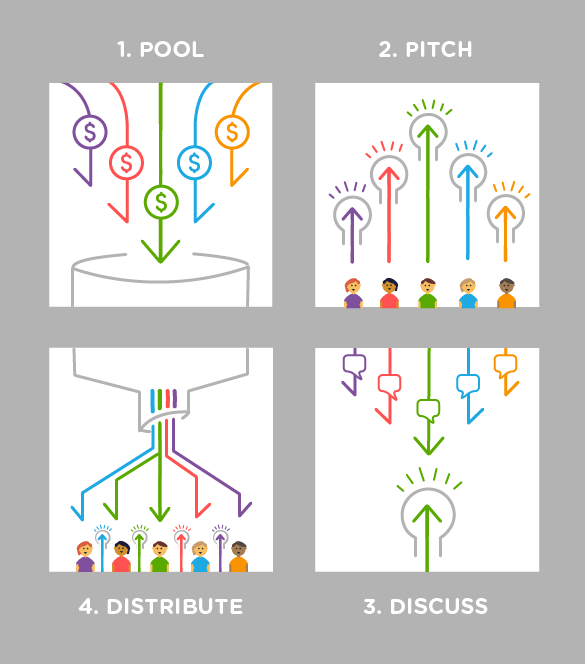

# What is the 'rounds' model?

**The proposal process described in this guide is focused on a model of running funding 'rounds'.**  

By this we mean that the proposal process has a clear beginning and end, as opposed to continuous funding. Most of the advice in this guide in steps 2, 3, 4 and 5 are applicable to both, but there are some key differences; as well as pros and cons for using rounds vs. doing continuous funding. 


Rounds have a clear beginning and end,  in contrast to a continuous funding model. 


The reason we chose to focus on the rounds model here, is because our experience has shown that it is a good model to get started. In some cases, a rounds model gradually turns into a continuous funding model over time \(if the practice is successful\). Read below for some of the advantages of rounds. 

## Why using rounds is a good idea

* **Focus and traction.** One of the challenges with collaborative proposal processes, as with most communication in all types of groups, is getting people's focused attention. Rounds help to focus people's energy and attention into a certain timespan, resulting in high activity.  
* **Easy to design iterative experiments.** By having a clear beginning and end

  to your round, you can design contained experiments to test certain ideas, and then re-configure or tweak the model for your next round. Especially if you run retrospectives in between rounds to reflect on how it went and how to better meet the needs of your group, the learning curve will be high and your process will get better with each round. 

* **Comparability of proposals**. When you run a round, proposals are all pitched within a defined timespan, rather than spread out over long periods of time. This means that group members will be able to compare proposals with each other when funding them. People with similar ideas are also more likely to see redundancies and areas for collaboration if they are pitching at the same time. 
* **Funds may be spent more strategically.** Since rounds give the group more focus and show a large number of proposals at once, this makes it easier to facilitate strategy making processes and prioritize which proposals will help achieve the group's goals. 


If you are _not_ using a rounds model, it is not possible \(or quite complicated\) to use the ****[money governance model ](../the-5-steps/untitled.md)of redistribution to all group members -- because you would need to know the size of your funding pool to know how much to redistribute. 


