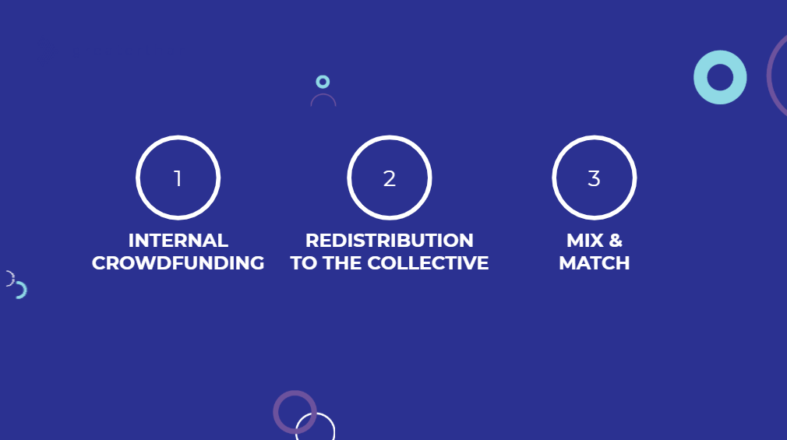

# Step 1: Choose your money governance model

**Before you can start, you need to define the basic parameters of your group setup. Here are some questions to answer in order to be able to do this.**

## Flow of funds

* Which organizations or individuals are contributing funds into your funding round? Do you already have a fixed budget, or are you looking to raise funds from the group members itself or from an external funder? 
* At what frequency will these funds come in? Will it be a regular frequency \(i.e. a fixed amount per week or month\), or do funds arrive ad hoc? The more visibility you have on the rhythm that funds will come in, the better; so you can design your round rhythm around the available funds.  

## **Decision-making power**

Organizations can use different parameters to distribute decision making power. In a participatory proposals process, like using Cobudget, the key parameter for who gets voting power over which funds is crucial.   
Key questions to be answered are:

* How will funds be distributed within the group?
* Will each person receive the same amount? If not, what are the different amounts of distributed funds based on?

Especially on questions around decision-making power, you may find disagreement in your team; so make sure to plan enough time for this conversation. Once you have clarified these aspects, you are ready to begin onboarding and start your funding process.

**For more guidance on this step and choosing the right money governance model, check out** [**this presentation.** ](https://www.slideshare.net/Greaterthanfinance/money-governance-models-for-cobudget)\*\*\*\*



Once you have chosen your parameters, you could use ****[**this template**](https://docs.google.com/document/d/1yK8A3HoT8Yd7ElYKfuccRibgCXb_yEj5Pu8WFMPAUts/edit#) to formalize your setup.


### \*\*\*\*[**Case Studies**](https://stories.greaterthan.finance/investing-surplus-for-impact-cobudgeting-at-outlandish-efa9890d0d4f)\*\*\*\*

See examples of how to setup these parameters in [this case study](https://stories.greaterthan.finance/investing-surplus-for-impact-cobudgeting-at-outlandish-efa9890d0d4f) about the developer cooperative Outlandish, who invests their surplus in impact projects.

...or check out how the agency [Blackwood Seven used Cobudget](https://guide.greaterthan.works/case-studies/agile-team-in-blackwoodseven) to spend their office budget.


